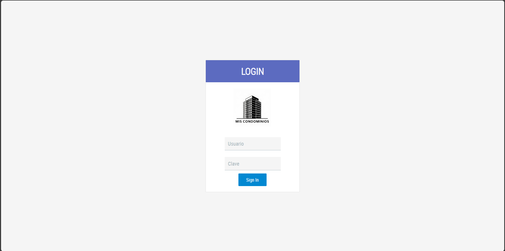
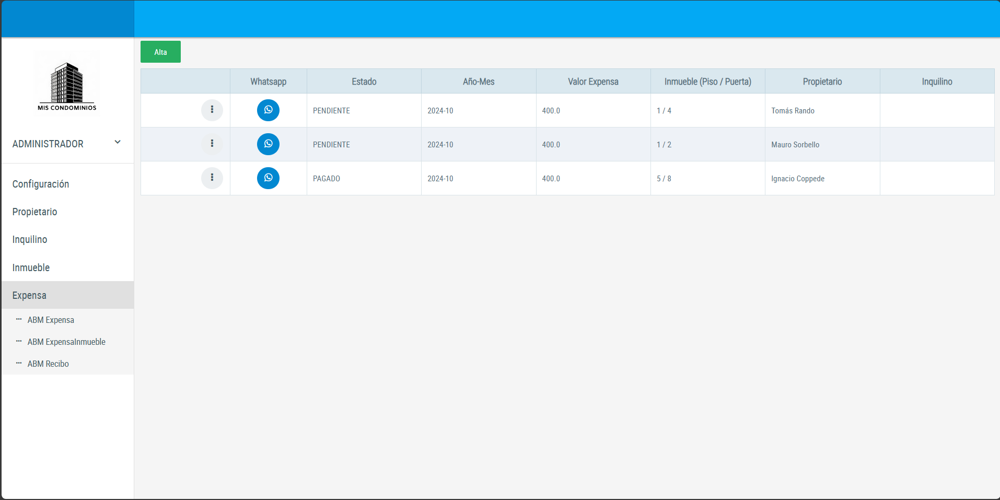
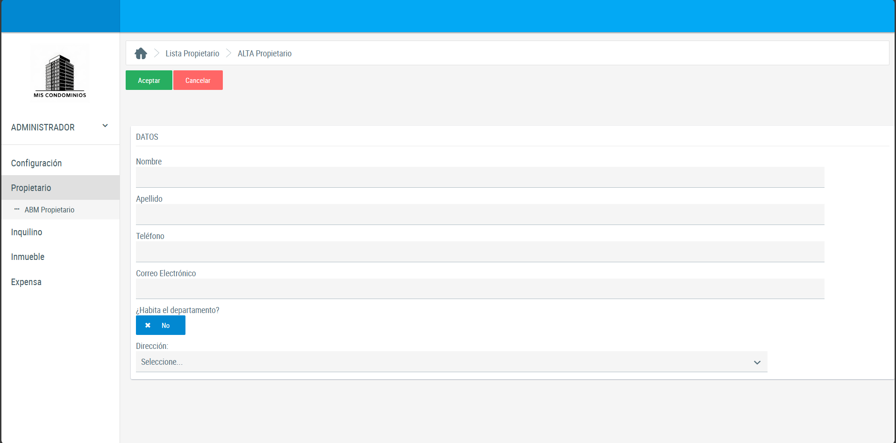

# ProyectoConsorcio
## Sistema
Sistema de gestión de expensas e inmuebles para un consorcio. Permite registrar expensas, inmuebles, dueños, inquilinos, entre otros, para notificar los montos pendientes por WhatsApp y enviar los recibos correspondientes mediante correo electrónico.  

El sistema fue realizado como proyecto para la materia "Ingeniería del Software II" en el año 2024.

## Integrantes
- Tomás Rando
- Mauro Sorbello
- Ignacio Coppede

## Imágenes

